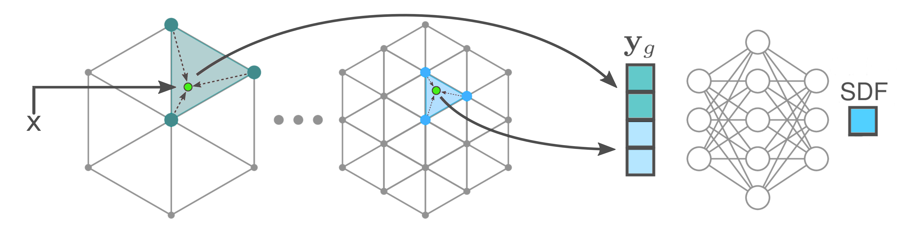

# Permutohedral Encoding 

This contains the official implementation of the permutohedral encoding which was originally proposed in [HashSDF: Accurate Implicit Surfaces with Fast Local Features on Permutohedral Lattices](https://arxiv.org/abs/2211.12562) 

Permutohedral encoding is used to obtain high-dimensional features from low-dimensionsal space. The features can then be used by a small MLP for decoding density, SDF, RGB or whatever quantity is needed. The encoding works by interpolating features from a multi-resolution permutohedral hash-map.
The permutohedral encoding is similar in spirit to the hash-map encoding of [InstantNGP](https://github.com/NVlabs/instant-ngp) but it scales linearly with dimensionality instead of exponentially. This makes it significantly faster to optimize for dimensions 3 and higher. 


<p align="middle">
  
</p>

### Usage

The permutohedral encoding can be used directly in PyTorch:

```py
import torch
import permutohedral_encoding as permuto_enc
import numpy as np

#create encoding
pos_dim=3
capacity=pow(2,18) 
nr_levels=24 
nr_feat_per_level=2 
coarsest_scale=1.0 
finest_scale=0.0001 
scale_list=np.geomspace(coarsest_scale, finest_scale, num=nr_levels)
encoding=permuto_enc.PermutoEncoding(pos_dim, capacity, nr_levels, nr_feat_per_level, scale_list)

#create points
nr_points=1000
points=torch.rand(nr_points, 3).cuda()

#encode
features=encoding(points)

#use the features, for example as input to an MLP
#sdf=mlp(features) 
```

<!--
### Example 

SDF 
-->


### Install

One can easily install it as a python package by using

```sh
$ git clone --recursive https://github.com/RaduAlexandru/permutohedral_encoding
$ cd permutohedral_encoding
$ make #this runs python install for the current user
```

This requires that PyTorch and CUDA are installed. 


<!-- ### Dependencies 
```sh
$ sudo python3 -m pip install  --verbose --no-cache-dir  torch-scatter==1.4.0 
```
You will also need to install both [EasyPBR] and [DataLoaders] with the intructions on the respective pages.


### Build and install: 
```sh
$ git clone --recursive https://git.ais.uni-bonn.de/rosu/lattice_net.git
$ cd lattice_net
$ make
```

### Training 
For training start the script: 
```sh
$ latticenet_py/lnn_train.py 
``` -->

   [EasyPBR]: <https://github.com/RaduAlexandru/easy_pbr>
   [DataLoaders]: <https://github.com/RaduAlexandru/data_loaders>


# License
Permutohedral Encoding is provided under the terms of the MIT license (see LICENSE).